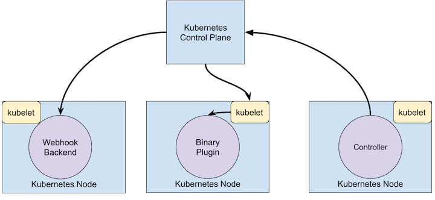

# Kubernetes

## 学习途径

建议穿插学习

- Books：`Kubernetes in Action`, `Programing Kubernetes`
- Videos: [https://space.bilibili.com/349215109/channel/detail?cid=92480](https://space.bilibili.com/349215109/channel/detail?cid=92480)

---

## 介绍

### Kubernetes 集群架构

### 控制平面组件（Control Plane Components）

控制面板用于控制集群并使它工作。它包含多个组件，组件可以 运行在单个主节点上或者通过副本分别部署在多个主节点以确保高可用性。这些组件是:

- `kube-apiserver` 服务器，你和其他控制面板组件都要和它通信
- `kube-scheduler`，它调度你的应用(为应用的每个可部署组件分配一个工作节点)
- `kube-controller-manager` 运行控制器进程的控制平面组件。
  - 节点控制器（Node Controller）: 负责在节点出现故障时进行通知和响应
  - 任务控制器（Job controller）: 监测代表一次性任务的 Job 对象，然后创建 Pods 来运行这些任务直至完成
  - 端点控制器（Endpoints Controller）: 填充端点(Endpoints)对象(即加入 Service 与 Pod)
  - 服务帐户和令牌控制器（Service Account & Token Controllers）: 为新的命名空间创建默认帐户和 API 访问令牌
- `etcd`，一个可靠的分布式数据存储，它能持久化存储集群配置
- `cloud-controller-manager` 使得你可以将你的集群连接到云提供商的 API 之上
  - 节点控制器（Node Controller）: 用于在节点终止响应后检查云提供商以确定节点是否已被删除
  - 路由控制器（Route Controller）: 用于在底层云基础架构中设置路由
  - 服务控制器（Service Controller）: 用于创建、更新和删除云提供商负载均衡器

### 工作节点组件（Node）

节点组件在每个节点上运行，维护运行的 Pod 并提供 Kubernetes 运行环境。

- `kubelet` 一个在集群中每个节点上运行的代理。它保证容器都运行在 Pod 中
- `kube-proxy` 维护节点上的网络规则。这些网络规则允许从集群内部或外部的网络会话与 Pod 进行网络通信

### Pods

`Pod` 是可以在 `Kubernetes` 中创建和管理的、最小的可部署的计算单元

- 运行单个容器的Pod
- 运行多个协同工作的Pod
- 它的成员容器间能够进行数据共享和通信

### initContainers

- 严格按照定义的顺序执行
- 可用于定义容器的前置工作
- 在规约中与 `容器（containers）` 平行

### ReplicaSet

`ReplicaSet` 的目的是维护一组在任何时候都处于运行状态的 `Pod` 副本的稳定集合。 因此，它通常用来保证给定数量的、完全相同的 `Pod` 的可用性。

- 一般不直接使用 `ReplicaSet` , 而是使用 `Deployment`, `Deployment` 是一个更高级的概念

### Deployment

一个 `Deployment` 为 `Pods` 和 `ReplicaSets` 提供声明式的更新能力。

---

## 扩展 Kubernetes

Kubernetes 是高度可配置且可扩展的。因此，大多数情况下，你不需要派生自己的 Kubernetes 副本或者向项目代码提交补丁。

### 概述

定制化的方法主要可分为 `配置（Configuration）`和 `扩展（Extensions）` 两种。 前者主要涉及改变参数标志、本地配置文件或者 API 资源；后者则需要额外运行一些程序或服务。

### Configuration

`Configuration` 参数标志和配置文件不总是可以修改的

- [kubelet](https://kubernetes.io/zh/docs/reference/command-line-tools-reference/kubelet/)
- [kube-apiserver](https://kubernetes.io/zh/docs/reference/command-line-tools-reference/kube-apiserver/)
- [kube-controller-manager](https://kubernetes.io/zh/docs/reference/command-line-tools-reference/kube-controller-manager/)
- [kube-scheduler](https://kubernetes.io/zh/docs/reference/command-line-tools-reference/kube-scheduler/)

### Extensions

`Extensions` 是一种 `Kubernetes` 原生支持的模式，可以编写高度可用的、运行稳定的自动化组件。

编写客户端程序有一种特殊的*Controller（控制器）*模式，能够与 `Kubernetes` 很好地协同工作。控制器通常会读取某个对象的 `.spec`，或许还会执行一些操作，之后更新对象的 `.status`。

控制器是 `Kubernetes` 的客户端。当 `Kubernetes` 充当客户端，调用某远程服务时，对应的远程组件称作 `Webhook`。 远程服务称作Webhook 后端。

在 `Webhook` 模式中，`Kubernetes` 向远程服务发起网络请求。 在*可执行文件插件（Binary Plugin）*模式中，`Kubernetes` 执行某个可执行文件（程序）。

  

### Custom Resources

`资源（Resource）` 是 `Kubernetes API` 中的一个端点， 其中存储的是某个类别的 `API 对象` 的一个集合。 例如内置的 `pods` 资源包含一组 `Pod` 对象。

### Operator

自定义资源 API 与控制回路的组合称作 `Operator` 模式。 `Operator` 模式用来管理特定的、通常是有状态的应用。 这些自定义 API 和控制回路也可用来控制其他资源，如存储或策略。

使用 Operator 可以自动化的事情包括：

- 按需部署应用
- 获取/还原应用状态的备份
- 处理应用代码的升级以及相关改动。例如，数据库 schema 或额外的配置设置
- 发布一个 service，要求不支持 Kubernetes API 的应用也能发现它
- 模拟整个或部分集群中的故障以测试其稳定性
- 在没有内部成员选举程序的情况下，为分布式应用选择首领角色
