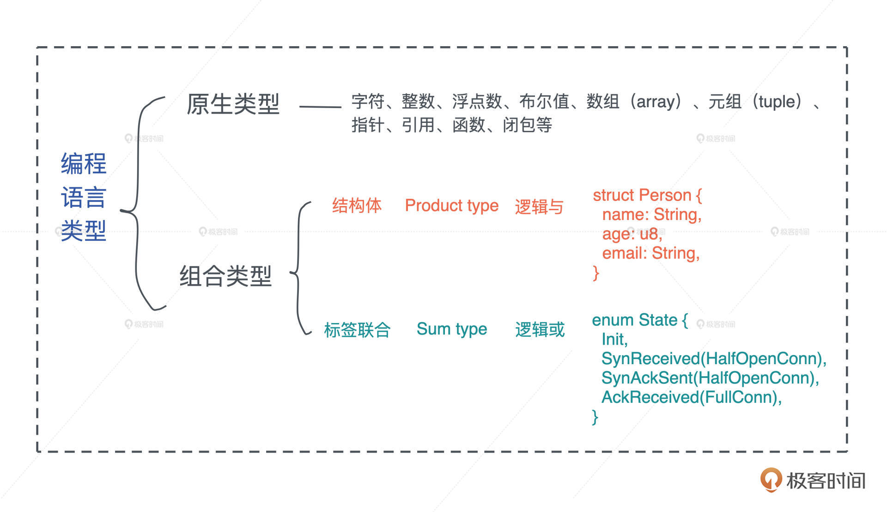

# Rust First Class

## Base Concept In Program

### 值和类型

1. 严谨地说，类型是对值的区分，它包含了值在内存中的长度、对齐以及值可以进行的操作等信息
2. 值是无法脱离具体的类型讨论的
3. 所有原生类型的大小都是固定的，因此它们可以被分配到栈上。
4. 结构体（structure type）：多个类型组合在一起共同表达一个值的复杂数据结构。
5. 标签联合（tagged union）：也叫不相交并集（disjoint union），可以存储一组不同但固定的类型中的某个类型的对象，具体是哪个类型由其标签决定。

> 不少语言**不**支持标签联合，只取其标签部分，提供了枚举类型（enumerate）。枚举是标签联合的子类型，但功能比较弱，无法表达复杂的结构。

